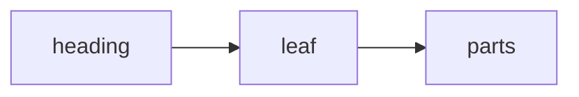

# Markdown reference

The introduction: prose on the root, before any heading. It is the root's leaf - the title
above repeats the doc's, so it is the root, not a node.

## Prose only

A section of prose alone: one part, however many paragraphs.

A second paragraph, and a list with `code` inline:

- an item
- another, with **strong** and *emphasis*
  - nested under it

> A quote, in the prose.

## A table between prose

Prose before the table.

| Construct | Where | Count |
|:---|:---:|---:|
| Prose | everywhere | many |
| A pipe \| escaped | in a cell | one |
| A pipe in `code | spans` | kept | one |

Prose after it: three parts, prose, table, prose.

## Code between prose

Prose before the code.

```java
record Point(int x, int y) {}
```

Prose between two fences.

~~~
Plain text, no language said.
# Not a heading: inside a fence.
~~~

Prose after: five parts.

## A table first

| Only | A table |
|---|---|
| no prose | before it |

## A diagram



## A section with its own content and children

Its own lead - its leaf - shown before its children.

### The first child

A child's content.

### The second child

#### Skipping a level

Nested under the second child, though its heading skips a level.

## A section with no content of its own

### Only a child

The section above has no leaf: nothing between its heading and this one.

## An empty heading

## Duplicate

The first of two headings alike.

## Duplicate

The second, named with a `-2`.

## The `TreePlacement`, **strong** and *emphasis*

A label drawn by runs: code as code, strong as strong.

## A heading far longer than forty characters, cut at a word and then digested

Its name is cut at a word, and six hex of a digest of the whole put after it.

## Café, crème and ümlauts

Accents dropped from the name.

## !!!

A heading with nothing namable in it: its name is `section`.

## Code inside a list

1. The first step:

   ```bash
   mvn install
   ```

2. The fence above is inside a list item: it stays in the prose.

## A quote holding a table

> | quoted | table |
> |---|---|
> | stays | prose |

A setext heading
----------------

A setext heading is prose, and so is the rule it is underlined with.
